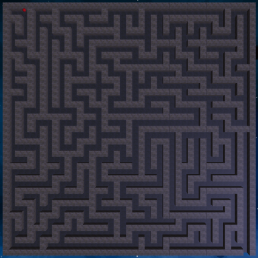
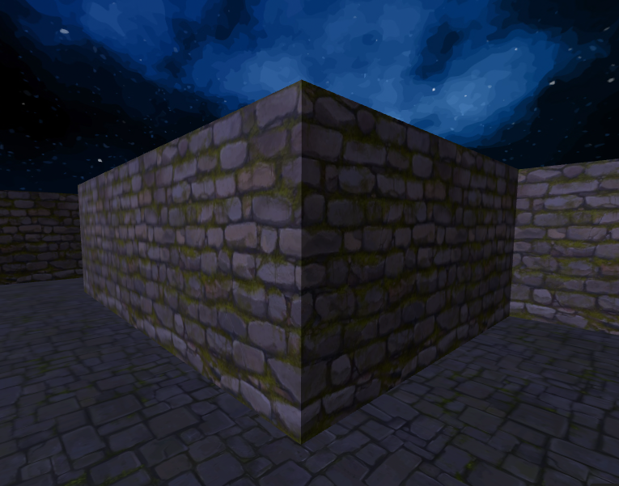

# 🕹️ maze-generator-aframe

Random maze generator with interactive 3D first-person exploration, built with Python and [A-Frame](https://aframe.io/).

## 🏗️ How it works

  

1. **Maze generation** — Recursive backtracking (randomized DFS) produces a perfect maze on a `(2N+1)×(2M+1)` expanded grid.
2. **3D rendering** — The grid is translated into A-Frame `<a-box>` entities, creating a navigable 3D environment.
3. **First-person navigation** — WASD/arrow keys with mouse look. Collision detection prevents walking through walls.
4. **Aerial view** — Press `T` to toggle a top-down camera with a red sphere marking your position.

> [!TIP]
> A-Frame requires the page to be served over HTTP.
> The [Live Preview](https://marketplace.visualstudio.com/items?itemName=ms-vscode.live-server)
> extension for VS Code is a quick way to launch a local server with live reload.

<br clear="right">

## 🎮 Usage


Edit `main.py` to change the maze size:

```python
ROWS = 25
COLS = 25
SAVE_MAZE = True
```
Run:

```bash
python main.py
```

This will output an HTML file in `./HTML/` and a PNG in `./Mazes`. Open it in any browser and solve the maze!

<br clear="right">

## 🗂️ Project structure

```
├── main.py                  # Entry point — configure size here
├── utils/
│   ├── backtracking.py      # Maze generation algorithm
│   └── maze_to_html.py      # A-Frame HTML writer
├── HTML/                    # Generated .html files
├── Images/                  # Decorative .jpg images
└── Mazes/                   # Generated maze plots (.png)

```

## ⌨️ Controls

<div align="center">

| Key | Action |
|-----|--------|
| `W` / `↑` | Move forward |
| `S` / `↓` | Move backward |
| `A` / `←` | Strafe left |
| `D` / `→` | Strafe right |
| Mouse | Look around |
| `T` | Toggle aerial view |

</div>

## ⚙️ Requirements

- Python 3
- NumPy
- Matplotlib

## 📄 License

This project is licensed under the [MIT License](LICENSE).

The MIT License is a permissive license that is short and to the point. It allows for broad use, modification, and distribution of the software.

| Permissions | Conditions | Limitations |
|---|---|---|
| ✅ Commercial use | ℹ️ License and copyright notice | ❌ Liability |
| ✅ Modification |  | ❌ Warranty |
| ✅ Distribution |  |  |
| ✅ Private use |  |  |

Key Terms
 * Rights: You can do almost anything with the code, including using it in proprietary software.
 * Requirement: You must include the original copyright notice and the license text in any copy of the software.
 * No Warranty: The software is provided "as is", and the authors cannot be held liable for any issues arising from its use.

