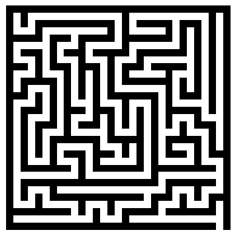

# 🕹️ maze-generator-aframe

Random maze generator with interactive 3D first-person exploration, built with Python and [A-Frame](https://aframe.io/).

## 🏗️ How it works



1. **Maze generation** — Recursive backtracking (randomized DFS) produces a perfect maze on a `(2N+1)×(2M+1)` expanded grid.
2. **3D rendering** — The grid is translated into A-Frame `<a-box>` entities, creating a navigable 3D environment.
3. **First-person navigation** — WASD/arrow keys with mouse look. AABB collision detection prevents walking through walls.
4. **Aerial view** — Press `T` to toggle a top-down camera with a red sphere marking your position.

<br clear="right">

## 🎮 Usage

Edit `main.py` to change the maze size:

```python
ROWS = 25
COLS = 25
```

```bash
python main.py
```

Output: an HTML file in `./HTML/`. Open it in any browser and solve the maze!

## 🗂️ Project structure

```
├── main.py                  # Entry point — configure size here
├── utils/
│   ├── backtracking.py      # Maze generation algorithm
│   └── maze_to_html.py      # A-Frame HTML writer
├── HTML/                    # Generated .html files
└── Mazes/                   # Generated maze plots (.png)
```

## ⌨️ Controls

<div align="center">

| Key | Action |
|-----|--------|
| `W` / `↑` | Move forward |
| `S` / `↓` | Move backward |
| `A` / `←` | Strafe left |
| `D` / `→` | Strafe right |
| Mouse | Look around |
| `T` | Toggle aerial view |

</div>

## ⚙️ Requirements

- Python 3
- NumPy
- Matplotlib
